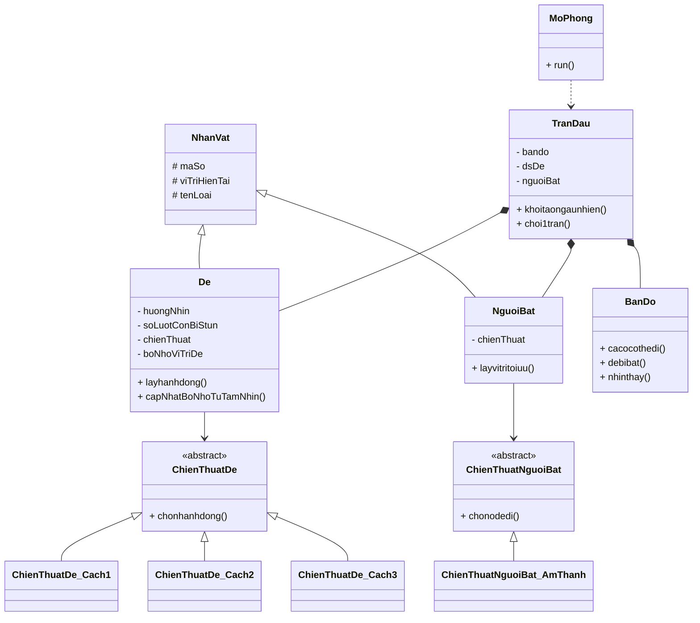

# Mini Project OOP - Mô phỏng trò chơi Bịt Mắt Bắt Dê

## Thành viên

| STT | Họ và tên | MSSV | Vai trò |
|---|---|---|---|
| 1 |  |  | Phân tích luật chơi, thiết kế ý tưởng mô phỏng |
| 2 |  |  | Thiết kế class, cài đặt chương trình C++ |
| 3 |  |  | Chạy mô phỏng, thống kê kết quả |
| 4 |  |  | Chuẩn bị slide, báo cáo và thuyết trình |

> Có thể chỉnh lại bảng thành viên theo đúng nhóm của bạn trước khi nộp.

## Link slide thuyết trình

https://www.canva.com/design/DAHJYsonEEc/OvUSATWTi_fGBAqloQmkKA/edit

---

## 1. Giới thiệu đề tài

**Bịt mắt bắt dê** là một trò chơi dân gian quen thuộc ở Việt Nam. Trong trò chơi truyền thống, một người bị bịt mắt sẽ dựa vào âm thanh và cảm nhận xung quanh để tìm bắt những người đóng vai dê. Người làm dê cần di chuyển khéo léo, phát ra tiếng kêu để tạo âm thanh nhưng vẫn phải tránh bị người bịt mắt bắt.

Dựa trên ý tưởng đó, project này xây dựng một chương trình C++ để **mô phỏng trò chơi Bịt mắt bắt dê trên bản đồ 2 chiều**. Thay vì chỉ chơi theo cảm tính, chương trình sẽ chạy nhiều trận mô phỏng để so sánh các chiến thuật di chuyển của dê và tìm ra cách chơi có tỉ lệ sống sót tốt hơn.

Điểm đặc biệt của project là trò chơi được mô hình hóa theo hướng **nhiều dê và một người bắt**, trong đó người chơi chỉ đóng vai một dê cụ thể gọi là **dê bản thân**. Dê bản thân được xem là thắng nếu không bị người bắt bắt trúng, kể cả trong trường hợp người bắt đã bắt được một dê khác.

---

## 2. Mục đích của project

Project được thực hiện nhằm:

- Vận dụng kiến thức lập trình hướng đối tượng trong C++.
- Mô phỏng một trò chơi dân gian bằng mô hình lưới 2 chiều.
- Thiết kế nhiều chiến thuật di chuyển khác nhau cho dê.
- Chạy mô phỏng nhiều trận để thống kê tỉ lệ thắng.
- So sánh các chiến thuật để tìm ra hướng chơi tối ưu hơn cho dê.

---

## 3. Luật chơi được mô phỏng

Trong chương trình, trò chơi được đơn giản hóa và mô phỏng theo các quy tắc sau:

1. Bản đồ là một mảng 2 chiều kích thước `sohang x socot`.
2. Có nhiều dê và một người bắt.
3. Mỗi lượt, dê và người bắt có thể:
   - đi lên,
   - đi xuống,
   - đi trái,
   - đi phải,
   - hoặc đứng yên.
4. Dê không được đi ra khỏi phạm vi bản đồ.
5. Người bắt bắt được dê nếu khoảng cách Manhattan giữa người bắt và dê `<= 1`.
6. Người bắt chỉ cần bắt được một dê bất kỳ thì trận đấu kết thúc.
7. Dê bản thân thua khi chính nó là dê bị bắt.
8. Dê bản thân thắng nếu:
   - hết số lượt tối đa mà không có dê nào bị bắt, hoặc
   - người bắt bắt được một dê khác không phải dê bản thân.
9. Nếu hai dê di chuyển đến quá gần nhau, tức khoảng cách Manhattan giữa chúng `<= 1`, cả hai bị xem là va chạm và bị đứng yên trong một số lượt.
10. Khi dê va chạm, sự kiện này tạo ra âm thanh để người bắt ưu tiên lần theo.
11. Người bắt nghe âm thanh có độ trễ một lượt, tức là quyết định di chuyển dựa trên vị trí trước đó của dê.
12. Dê có hướng nhìn. Khi dê muốn dùng thông tin vị trí của người bắt hoặc dê khác, đối tượng đó phải nằm trong tầm nhìn của dê.
13. Trước khi bắt đầu, các dê biết vị trí ban đầu của toàn bộ dê khác và người bắt.

---

## 4. Cơ chế tầm nhìn của dê

Mỗi dê có một hướng nhìn thuộc một trong bốn hướng:

```cpp
TRAI, PHAI, TREN, DUOI
```

Nếu dê đang nhìn sang trái, dê chỉ nhìn thấy các đối tượng có chỉ số cột nhỏ hơn cột hiện tại. Tương tự:

| Hướng nhìn | Vùng nhìn thấy |
|---|---|
| `TRAI` | Các ô nằm bên trái dê |
| `PHAI` | Các ô nằm bên phải dê |
| `TREN` | Các ô nằm phía trên dê |
| `DUOI` | Các ô nằm phía dưới dê |

Khi dê muốn né người bắt hoặc tránh dê khác, chương trình phải kiểm tra đối tượng đó có nằm trong tầm nhìn hay không. Nếu không nhìn thấy, dê không được dùng trực tiếp vị trí thật của đối tượng đó, trừ chiến thuật có sử dụng bộ nhớ.

---

## 5. Chiến thuật của dê

Project hiện cài đặt 3 chiến thuật cho dê.

### 5.1. Chiến thuật 1 - Luôn để ý người bắt

Ở mỗi lượt, dê cố gắng luôn giữ người bắt trong tầm nhìn. Nếu người bắt không nằm trong hướng nhìn hiện tại, dê sẽ mất một lượt để đổi hướng nhìn về phía người bắt.

Khi đã nhìn thấy người bắt, dê xét các ô có thể đi và chấm điểm từng ô dựa trên các yếu tố:

- khoảng cách đến người bắt,
- khoảng cách đến biên,
- số ô tiếp theo có thể di chuyển,
- khoảng cách đến dê gần nhất đang nhìn thấy.

Ô có điểm cao nhất sẽ được chọn.

### 5.2. Chiến thuật 2 - Đánh lạc hướng người bắt

Chiến thuật này dựa trên ý tưởng: nếu có một dê khác đang gần người bắt hơn, người bắt có khả năng sẽ đuổi theo dê đó. Vì vậy, dê bản thân sẽ cố gắng tránh xa dê đang bị người bắt chú ý.

Sau một chu kỳ nhất định, dê sẽ khảo sát lại xung quanh để cập nhật mục tiêu cần tránh. Nếu chính dê bản thân đang là dê gần người bắt nhất, nó sẽ chuyển sang ưu tiên né người bắt giống chiến thuật 1.

### 5.3. Chiến thuật 3 - Người chơi hệ bao quát

Chiến thuật này sử dụng bộ nhớ vị trí. Ban đầu, dê biết vị trí của tất cả người chơi. Trong quá trình chơi:

- Nếu đối tượng nằm trong tầm nhìn, dê cập nhật vị trí thật.
- Nếu đối tượng không nằm trong tầm nhìn, dê dùng vị trí đã ghi nhớ trước đó.
- Sau một số lượt, dê sẽ khảo sát lại các hướng để cập nhật thông tin.

Chiến thuật này mô phỏng một người chơi biết quan sát tổng thể và ghi nhớ vị trí tương đối của các đối tượng khác.

---

## 6. Thuật toán của người bắt

Người bắt không nhìn thấy dê, chỉ dựa vào âm thanh. Trong mỗi lượt, người bắt xét vị trí âm thanh của các dê ở lượt trước đó.

Nếu khoảng cách đến dê gần nhất là `a`, xác suất người bắt xác định đúng hướng được mô phỏng như sau:

| Khoảng cách đến dê gần nhất | Tỉ lệ xác định đúng hướng |
|---|---|
| `a <= 3` | 90% |
| `a <= 5` | 70% |
| `a <= 7` | 40% |
| `a > 7` | Đi ngẫu nhiên về một vùng có dê |

Nếu có sự kiện dê va chạm và bị stun, người bắt sẽ kiểm tra xem có nên ưu tiên đi đến vị trí va chạm hay không. Nếu vị trí va chạm có lợi hơn so với việc đuổi theo âm thanh thông thường, người bắt sẽ ưu tiên lần theo vị trí va chạm.

---

## 7. Hàm tính điểm di chuyển của dê

Khi cần chọn ô di chuyển, dê sẽ xét các ô hợp lệ xung quanh, bao gồm cả ô đứng yên. Mỗi ô được chấm điểm theo công thức:

```cpp
Score = HS_khoangcachtoinguoibat * rank_khoangcachtoinguoibat
      + HS_khoangcachtoibien * rank_khoangcachtoibien
      + HS_sootieptheocothedi * rank_sootieptheocothedi
      + HS_khoangcachtoidegannhat * rank_khoangcachtoidegannhat;
```

Trong đó:

| Thành phần | Ý nghĩa |
|---|---|
| `rank_khoangcachtoinguoibat` | Ưu tiên ô xa người bắt hơn |
| `rank_khoangcachtoibien` | Ưu tiên ô không quá sát biên |
| `rank_sootieptheocothedi` | Ưu tiên ô còn nhiều hướng đi tiếp |
| `rank_khoangcachtoidegannhat` | Ưu tiên ô xa dê khác để tránh va chạm |

Các hệ số `HS_...` có thể thay đổi để thử nghiệm và tìm bộ tham số cho tỉ lệ thắng cao hơn.

---

## 8. Kiến thức OOP được sử dụng

Project có sử dụng các kiến thức lập trình hướng đối tượng sau:

| Kiến thức OOP | Cách áp dụng trong project |
|---|---|
| Class và Object | Tạo các lớp `BanDo`, `NhanVat`, `De`, `NguoiBat`, `TranDau`, `MoPhong` |
| Encapsulation | Dữ liệu được đặt trong `private` hoặc `protected`, truy cập qua hàm public |
| Inheritance | `De` và `NguoiBat` kế thừa từ `NhanVat` |
| Abstraction | `ChienThuatDe` và `ChienThuatNguoiBat` là lớp chiến thuật trừu tượng |
| Polymorphism | Gọi chiến thuật thông qua con trỏ lớp cha |
| Method Overriding | Các chiến thuật cụ thể ghi đè hàm `chonhanhdong()` và `chonodedi()` |
| Composition | `TranDau` chứa `BanDo`, danh sách `De` và `NguoiBat` |
| Strategy Pattern | Tách từng cách chơi của dê thành class riêng |

---

## 9. Sơ đồ class rút gọn



---

## 10. Cấu trúc thư mục

```text
.
├── CMakeLists.txt
├── Makefile
├── README.md
├── include/
│   ├── BanDo.h
│   ├── ChienThuat.h
│   ├── ChienThuatDeCuThe.h
│   ├── ChienThuatNguoiBatAmThanh.h
│   ├── Config.h
│   ├── De.h
│   ├── HuongNhin.h
│   ├── KieuDuLieu.h
│   ├── MoPhong.h
│   ├── NguoiBat.h
│   ├── NhanVat.h
│   ├── Random.h
│   ├── ScoreHelper.h
│   ├── TranDau.h
│   └── ViTri.h
└── src/
    ├── BanDo.cpp
    ├── ChienThuatDeCuThe.cpp
    ├── ChienThuatNguoiBatAmThanh.cpp
    ├── Config.cpp
    ├── De.cpp
    ├── HuongNhin.cpp
    ├── MoPhong.cpp
    ├── NguoiBat.cpp
    ├── NhanVat.cpp
    ├── Random.cpp
    ├── ScoreHelper.cpp
    ├── TranDau.cpp
    └── main.cpp
```

---

## 11. Vai trò của từng nhóm file

| Nhóm file | Vai trò |
|---|---|
| `Config.h/.cpp` | Chứa thông số mô phỏng như kích thước bản đồ, số dê, số lượt, hệ số score |
| `ViTri.h` | Biểu diễn tọa độ hàng, cột và tính khoảng cách Manhattan |
| `HuongNhin.h/.cpp` | Biểu diễn hướng nhìn của dê |
| `KieuDuLieu.h` | Chứa các struct như `QuyetDinhDe`, `SuKienVaCham`, `KetQuaTran`, `ThongKeMoPhong` |
| `BanDo.h/.cpp` | Xử lý luật bản đồ, ô hợp lệ, tầm nhìn, khoảng cách và điều kiện bắt dê |
| `NhanVat.h/.cpp` | Lớp cha chứa thông tin chung của nhân vật |
| `De.h/.cpp` | Quản lý trạng thái của dê như hướng nhìn, stun, bộ nhớ và khảo sát |
| `NguoiBat.h/.cpp` | Quản lý hành động của người bắt |
| `ChienThuat.h` | Khai báo lớp chiến thuật trừu tượng |
| `ChienThuatDeCuThe.h/.cpp` | Cài đặt 3 chiến thuật của dê |
| `ChienThuatNguoiBatAmThanh.h/.cpp` | Cài đặt thuật toán người bắt dựa vào âm thanh |
| `ScoreHelper.h/.cpp` | Chứa hàm tính rank, tính score và hỗ trợ chọn ô đi |
| `TranDau.h/.cpp` | Điều khiển một trận đấu hoàn chỉnh |
| `MoPhong.h/.cpp` | Chạy nhiều trận đấu và thống kê kết quả |
| `main.cpp` | Tạo chiến thuật, chạy mô phỏng và in kết quả |

---

## 12. Cách chạy chương trình

### Cách 1: Build bằng Makefile

```bash
make
make run
```

### Cách 2: Build bằng CMake

```bash
cmake -S . -B build
cmake --build build
./build/bit_mat_bat_de
```

Nếu dùng Windows, file chạy có thể nằm ở:

```bash
./build/Debug/bit_mat_bat_de.exe
```

---

## 13. Chỉnh thông số mô phỏng

Các thông số chính nằm trong file:

```text
src/Config.cpp
```

Ví dụ:

```cpp
const int sohang = 10;
const int socot = 10;
const int sode = 4;
const int soluottoida = 100;
const int sotranmophong = 1000;
const int soluotstun = 3;
```

Nếu muốn tăng số trận mô phỏng, sửa:

```cpp
const int sotranmophong = 1000;
```

thành:

```cpp
const int sotranmophong = 10000;
```

Các hệ số score cũng nằm trong `src/Config.cpp`:

```cpp
int HS_khoangcachtoibien = 2;
int HS_khoangcachtoidegannhat = 3;
int HS_khoangcachtoinguoibat = 4;
int HS_sootieptheocothedi = 1;
```

Có thể thay đổi các hệ số này để thử nghiệm chiến thuật mới.

---

## 14. Kết quả chương trình

Sau khi chạy, chương trình sẽ in kết quả thống kê cho từng chiến thuật, bao gồm:

- số trận dê bản thân thắng,
- số trận dê bản thân bị bắt,
- số trận người bắt thắng,
- số trận hết giờ mà chưa bắt được dê nào,
- tỉ lệ thắng của dê bản thân.

Ví dụ dạng kết quả:

```text
===== Cach 1 - Luon de y nguoi bat =====
So tran de ban than thang: ...
So tran de ban than bi bat: ...
So tran nguoi bat thang: ...
So tran het gio ma chua bat duoc de nao: ...
Ti le de ban than thang: ...%
```

---

## 15. Hướng phát triển tiếp theo

Một số hướng có thể mở rộng:

- Tự động thử nhiều bộ hệ số score để tìm bộ hệ số tối ưu.
- Cho mỗi dê dùng một chiến thuật khác nhau trong cùng một trận.
- Xuất kết quả mô phỏng ra file CSV để vẽ biểu đồ.
- Thêm vật cản trên bản đồ.
- Thêm chế độ xem log từng lượt để quan sát đường đi.
- Thiết kế giao diện trực quan bằng thư viện đồ họa đơn giản.

---

## 16. Tài liệu tham khảo

- Hướng dẫn trò chơi Bịt Mắt Bắt Dê: https://www.thegioididong.com/game-app/cach-choi-bit-mat-bat-de-huong-dan-luat-choi-cach-choi-chi-1388369
- Slide thuyết trình của project: https://www.canva.com/design/DAHJYsonEEc/OvUSATWTi_fGBAqloQmkKA/edit
